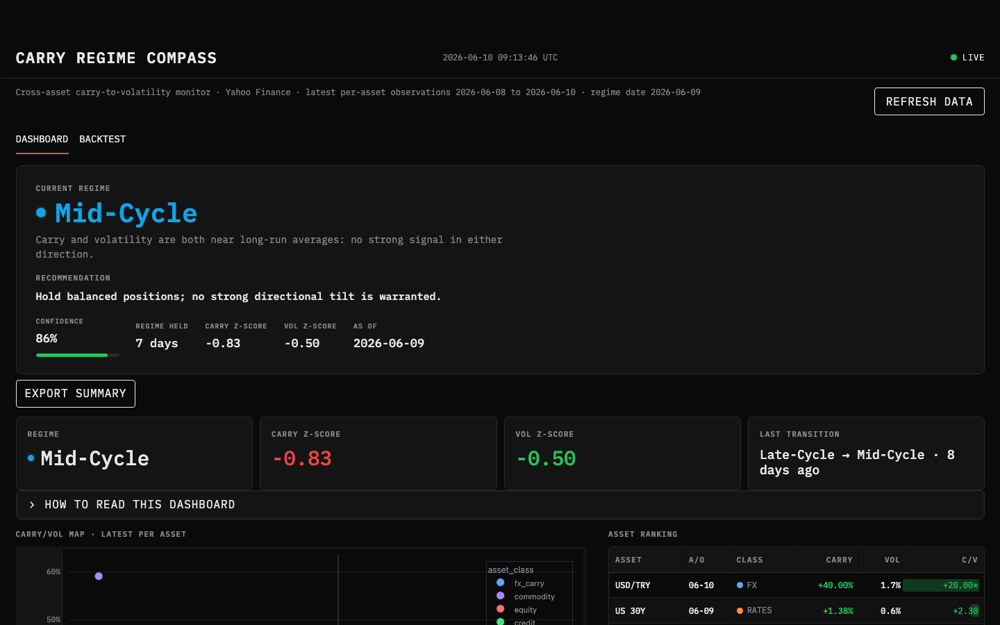

# Carry Regime Compass

A cross-asset macro regime monitor that asks one question every day: are global markets rewarding carry, or punishing it? The answer drives a four-state regime label (Risk-On, Mid-Cycle, Late-Cycle, Deleveraging) with a walk-forward backtest to show whether that label would have been worth trading on.

**Live app:** [carry-regime-compass.streamlit.app](https://carry-regime-compass.streamlit.app)



---

## The problem

Carry signals span every asset class - FX, rates, credit, equities, and commodities - but each is quoted in different units. A trader watching FX carry in isolation misses the signal from widening HY spreads or collapsing equity dividend yields. This project aggregates the carry-to-volatility ratio across all five asset classes into a single cross-asset centroid and classifies it against its own rolling history.

## The approach

1. **Data**: Yahoo Finance prices for 31 instruments across 5 asset classes, fetched daily and cached in SQLite. Optional FRED macro overlays (VIX, Fed Funds, yield curve, HY spread).
2. **Feature engineering**: carry proxy divided by 30-day realized volatility for each instrument. This normalizes the raw carry signal by current market risk, giving a dimensionless ratio comparable across asset classes.
3. **Regime inference**: daily cross-sectional median carry and vol are z-scored over the full history. The (carry_z, vol_z) pair is mapped to one of four labels via threshold rules in `universe.yaml`. A 5-day confirmation window suppresses label flicker.
4. **Backtest**: walk-forward simulation from the full history. The allocation on day t uses the confirmed regime from day t-1, carry rankings from day t-1. Configurable transaction costs and concentration.

### Regime labels

| Regime | Carry z-score | Vol z-score | Plain meaning |
|--------|--------------|-------------|---------------|
| Risk-On | >= 0.5 | <= -0.2 | Carry is rich, volatility is calm |
| Mid-Cycle | near 0 | near 0 | No strong signal |
| Late-Cycle | > 0 | > -0.2 | Carry fading, vol building |
| Deleveraging | <= -0.3 | >= 1.0 | Stress: carry collapsed, vol spiked |

---

## What the backtest shows

The backtest applies a simple regime-conditional allocation rule:
- **Deleveraging**: 100% cash (no exposure)
- **Risk-On**: equal-weight top-N assets by carry/vol ratio
- **Mid-Cycle / Late-Cycle**: equal-weight all assets

The UI shows an equity curve versus equal-weight benchmark, split into in-sample and out-of-sample windows. The default history is 400 days, which covers roughly one business cycle phase. Increase `history_days` in `carry_compass/config/universe.yaml` to 2000+ to see a longer track record including 2022.

**Honest caveats**: regime thresholds are not fit from data - they are researcher-set and tested post-hoc. The signal is explanatory, not predictive in a strict statistical sense. Do not use this to size positions.

---

## Run locally

### Prerequisites

- Python 3.11
- Optional: `FRED_API_KEY` environment variable for macro overlays

### Setup

```bash
git clone https://github.com/NicolasMasselot/carry-regime-compass.git
cd carry-regime-compass

python -m venv .venv
source .venv/bin/activate   # Windows: .venv\Scripts\activate
pip install -e ".[dev]"
```

### Start the app

```bash
python -m streamlit run carry_compass/viz/app.py
```

First launch fetches price history from Yahoo Finance (a few seconds per ticker). After that the data is cached in `data/cache/prices.db` and subsequent launches are instant.

### Run the tests

```bash
pytest
```

50 tests covering carry computation, regime classification, backtest no-lookahead guarantee, metrics, and the allocation rule.

### Run the pipeline manually

```bash
python -m carry_compass.pipeline.run
python -m carry_compass.pipeline.run --force          # bypass cache
python -m carry_compass.pipeline.run --lookback 1500  # extended history
```

The pipeline writes a versioned parquet snapshot under `data/snapshots/` that the Streamlit app reads on startup. The daily GitHub Action runs this automatically at 06:30 UTC on weekdays.

### FRED macro overlays (optional)

```bash
export FRED_API_KEY=your_key_here
python -m carry_compass.pipeline.run
```

Get a free key at https://fred.stlouisfed.org/docs/api/api_key.html. Without the key the pipeline skips FRED silently.

---

## Project layout

```
carry_compass/
  config/       universe.yaml (31 tickers, thresholds, FRED series)
  data/         yfinance fetcher with retry and local SQLite cache
  carry/        asset-class carry proxies (FX, rates, credit, equity, commodity)
  vol/          30-day realized volatility and carry/vol panel
  regime/       centroid, 4-label classifier, 5-day anti-flicker smoothing
  backtest/     walk-forward engine, allocator, metrics, no-lookahead tests
  decision/     headline call, regime alerts, webhook scaffold
  pipeline/     ingest, transform, inference, CLI entry point
  viz/          Streamlit app, Plotly components, backtest tab
data/
  cache/        SQLite price cache (gitignored)
  snapshots/    versioned parquet files committed to git (Streamlit Cloud reads these)
.github/
  workflows/    daily_pipeline.yml (data), ci.yml (tests on every push)
```

---

## Stack

Python 3.11, Streamlit, Plotly, pandas, NumPy, SciPy, yfinance, SQLAlchemy, SQLite, pyarrow, Pydantic, fredapi, pytest, Ruff.

---

## Known limits

- FX carry uses policy-rate differentials, not OIS or cross-currency swap points.
- Credit carry uses ETF yield proxies rather than full OAS curves.
- Equity carry uses static earnings-yield inputs, not point-in-time consensus estimates.
- Commodity carry is proxy-based because full futures term structures are not available from Yahoo Finance.
- Default history of 400 days is short for backtesting across a full cycle. Extend via `lookback` flag.
