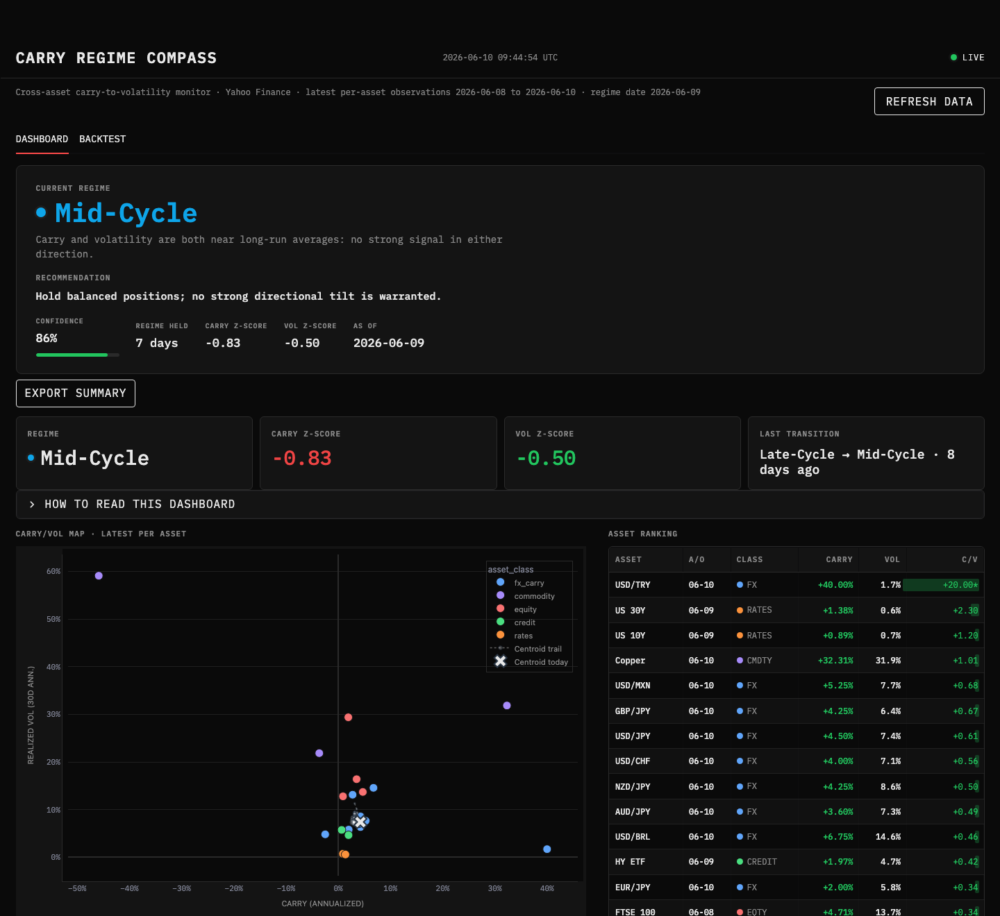

# Carry Regime Compass

A Python system that reads the mood of global markets. It ingests live data across 26 instruments and five asset classes, detects which regime markets are in, and turns that signal into a clear recommendation. It then proves the signal has value by backtesting it out of sample, with no lookahead.

Live app: https://carry-regime-compass.streamlit.app



## The problem

Markets move between distinct regimes: calm and trending, stressed and risk-off, recovering. The regime you are in changes what a sensible decision looks like, but the regime is never labeled in real time. You only know it in hindsight. The hard part is detecting the current regime from noisy, multi-source data, early enough to act, and trusting that the detection is real rather than a pattern fitted after the fact.

## What it does

The system runs the full path from raw data to a decision.

It ingests live time series across 26 instruments and five asset classes, prices from Yahoo Finance and macro series from FRED. It cleans and aligns them, computes carry and volatility features, and classifies the current market regime. From that regime it produces a plain recommendation a non-expert can read. The current state, how long it has held, and any recent regime change are surfaced first, so a visitor understands the situation in a few seconds.

## Why it is trustworthy

A regime monitor that only colors the past is a dashboard. The point here is to show the signal would have been worth acting on, and to do it honestly.

The backtest is strictly out of sample, with an explicit no-lookahead guarantee: the allocation on any given day uses only information available up to that day. A regime-driven decision rule is compared against a naive benchmark, with standard metrics, return, volatility, Sharpe, and max drawdown. Detected regimes are validated against known stress periods, March 2020 and the 2022 drawdown, shown on a dated chart. Where the signal is weak, the results say so.

The engineering backs this up. 50 tests cover carry computation, regime classification, the metrics, the allocation rule, and a dedicated test that asserts the backtest cannot see the future. A GitHub Action refreshes the data automatically every weekday.

## Stack

Python, pandas, NumPy, SQLite, Streamlit, Plotly. Data pipeline automated with GitHub Actions.

## Run locally

Requires Python 3.11.

```
git clone https://github.com/NicolasMasselot/carry-regime-compass.git
cd carry-regime-compass
python -m venv .venv
source .venv/bin/activate   # Windows: .venv\Scripts\activate
pip install -e ".[dev]"
python -m streamlit run carry_compass/viz/app.py
```

Run the tests with `pytest`. Run the pipeline manually with `python -m carry_compass.pipeline.run`; it writes a versioned parquet snapshot under `data/snapshots/` that the app reads on startup.

FRED macro overlays are optional. Set a free `FRED_API_KEY` from https://fred.stlouisfed.org/docs/api/api_key.html before running the pipeline. Without it, the pipeline skips FRED silently.
